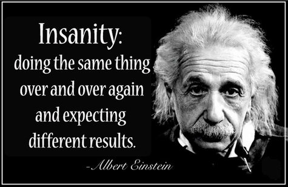

# 30 day of JavaSCript Coding Challenge

> Make something using HTML, CSS and Vanilla JavaScript 🚀 for 30 day

# Motivation

예전에 `WesBos`라는 분의 [JavaScript30](https://javascript30.com/)이라는 프로젝트를 본적이 있다. 이 프로젝트는 유튜브에서도 검색하면 수업형태로 무료로 시청이 가능하다. 여기에 영향을 받은 것인지 더 나아가 [100일 동안 진행한 챌린지](https://www.florin-pop.com/blog/2019/09/100-days-100-projects/)도 있었다. 100개의 주제를 가지고 매일 무엇인가를 만들어나가는 챌린지이다. 30일이든 100일이든 구현해보고 싶은 것에 대한 컨텐츠, 아이디어가 샘 솟아야 가능한게 아닐까 하는 생각이 든다. 이러한 프로젝트들을 보면서 나 역시 한번 도전해보고 싶은 생각이 예전부터 있었다. <u>드디어 바로 오늘이 챌린지 도전의 날이 되었다.</u>👍 물론 <del>100일</del>은 아니고 **30일**만 😅... + 아이디어 역시 <del>나만의 독창적인 아이디어</del>까지는 아니고 `WesBos`와`Florin Pop` 횽님들의 것들을 참고하여서 만들 예정이다.

# Goals

-   [x] 반드시 30일 동안 매일 진행한다.
-   [x] 코드를 단순 따라하는 것(copy & paste)은 절대 금지한다.
-   [x] 내 생각을 코드로 구현한다

 

> 내가 항상 생각하지만 항상 지키지 못하는 말이다. 내가 미친짓을 하고 있는지 진짜 미쳤는지 이 챌린지를 통해서 알아보자 😎

> 어제보다 오늘이, 오늘보다 내일이 더 멋질 수 있기를...🎈

# Contents

| #Day |                     Contents                     |   Date   |
| :--: | :----------------------------------------------: | :------: |
|  01  |        [Piano Keyboard](day01/README.md)         | 20.08.17 |
|  02  | [Digital Clock vs Analog Clock](day02/README.md) | 20.08.18 |
|  03  |           [Dark Mode](day03/README.md)           | 20.08.19 |
|  04  |      [Currency Converter](day04/README.md)       | 20.08.20 |
|  05  |        [Infinite Scroll](day05/README.md)        | 20.08.21 |
|  06  |         [Movie Filter](day06/README.md)          | 20.08.22 |
|  07  |        [MVC Calculator](day07/README.md)         | 20.08.23 |
|      |                                                  |          |
|      |                                                  |          |
