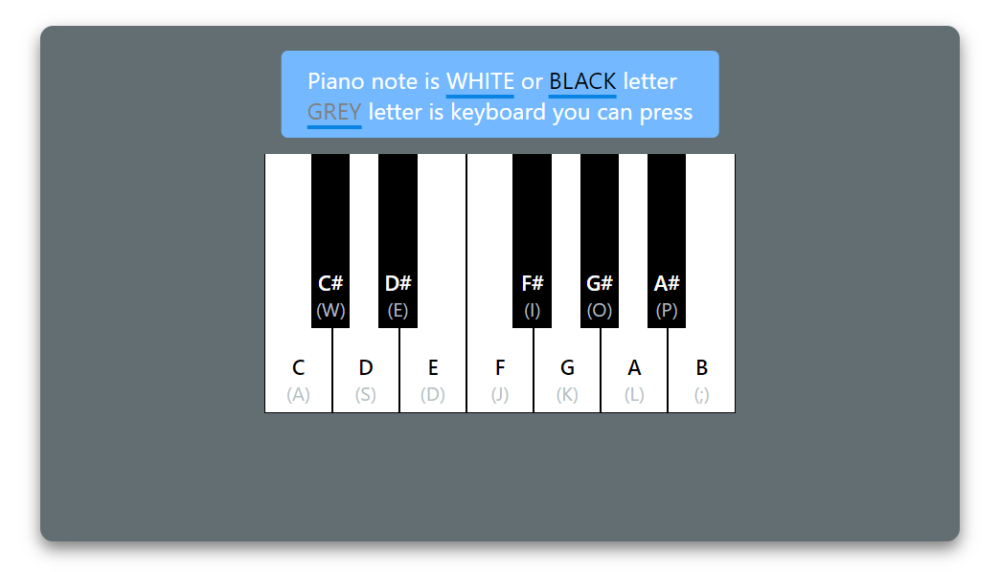
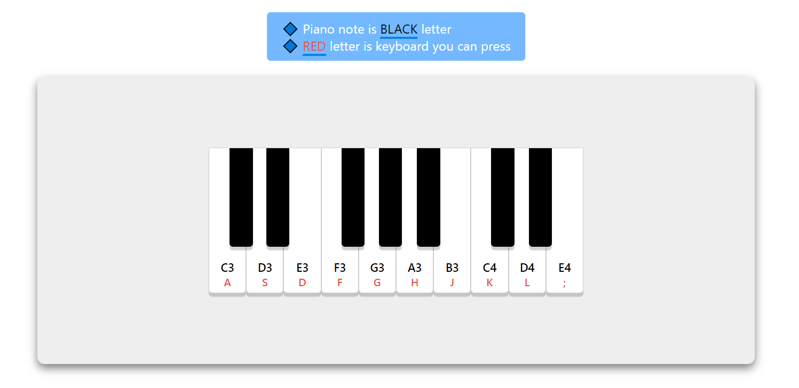

# Day01 : Piano Keyboard

# Preview



> 첫번째는 UI, 하지만 `#음`을 구할수가 없어서 아래와 같이 변경하였다.



> 현재 UI

# Challenge

## `key note audio source`

이것은 당연한 것이지만 피아노 소리가 나게 하기위해선 피아노 음에 대한 음원이 있어야 한다. 하지만 이러한 `assets`이라고 불리는 것을 찾는게 쉽지 않았다. _현재 만들어진 것 역시 소리가 좋지 못하다._ 항상 느끼는거지만 만들고 싶은 것이 있어도 제대로 된 소스가 없으면 원하는대로 구현이 안되는 것 같다. 또 그것 때문에 계획을 수정해야하는 불상사가 일어나기도 하는 것 같다. `30 day Challenge`를 진행하면서 다양한 소스를 얻을 수 있는 사이트들에 대해서 많이 알아봐야겠다.

> 현재는 [이분](https://carolinegabriel.com/javascript-piano/)의 사이트 내에 있는 데이터베이스에 저장된 음원을 가져와서 사용하였다. 조만간 나만의 음원으로 바꿔야겠다...(불법(?)사용 죄송합니다.😭)

## `keydown`과 `keyup` 그리고 `transformend`

-   keydown / keyup

    > `keydown` 이벤트는 키가 눌릴 때, 발생한다. 반대로 `keyup` 이벤트는 눌러진 키가 올라올 때 발생한다. 즉 이 두가지 이벤트를 동시에 사용하면 눌리는 효과를 나타낼 수 있다.

    <br/>

    

    > > 키가 눌렸다 올라왔다를 반복하면서 눌리는 순간에만 글자가 표시되도록 만들었던적이 있다.

    <br/>

    > 이벤트 속성에서 눌리는 키와 올라오는 키를 알 수 있기 때문에 `data-src`를 이용하여 키코드를 지정하여서 HTML와 DOM사이의 이벤트 상호작용을 컨트롤 할 수 있게 만들었다.

    <br/>

    > > 참고로 `data-src`를 selector로서 사용할 때 `syntax`를 매번 찾아보는 것 같아서 정리해본다.

    ```javascript
    //syntax (쌍/홑따옴표의 순서는 바껴도 된다)
    //document.querySelector('element[data-src="value"]')

    //일반적인 경우
    const target = document.querySelector("audio[data-key='65']");

    //leteral templates인 경우
    const target = document.querySelector(`div[data-key='${e.code}']`);
    ```

-   transformend event

    > `transformend event` : _이러한 이벤트가 있다는 것을 오늘 처음 알게되었다._ 이 이벤트 CSS의 transform이 끝날 때 일어나는 이벤트이다. 이벤트 속성을 출력해보면 CSS의 transform이 일어날 때마다(각각이 끝날 때마다) 콘솔창에 내역이 찍힌다. 또한 `e.target`으로 하여 transform이 일어난 타켓을 특정할 수 있다. 그렇기 때문에 keydown이 일어난 후에 위 이벤트를 이용하여 건반이 눌리고 눌리는 모습이 진행된 후에 조작을 할 수 있게 된다.

    ```javascript
    target.addEventListener('transitionend', function (e) {
        e.target.classList.remove('pressed');
    });
    ```

    > 여기서 주의점은 반드시 `event의 타겟에서는 transfrom이 일어나야한다`. 만약에 transform이 일어나지 않는다면 이벤트가 발생하지않는다.

## `audio` 태그

> 사실 audio 태그를 직접 사용해본 적은 없다. 딱히 유사게임(?)을 만들 때도 비쥬얼적인 면을 더 신경썼기 때문에 사용할 여력이 없었던 것 같다. 다행이 이해하기 어렵거나 사용하기 어려운 태그는 아니다. 여기서 사용한 메소드와 프로퍼티는 `play(`)와 `currentTime`이다.

-   play() : 음악을 재생한다.
-   currentTime : 음악의 현재 위치를 지정한다. audio 태그에서는 음악을 중지시키는 pause()와 같은 메소드가 존재하지않는다. 그렇기 때문에 중간에 음악을 정지시키고 새롭게 시작하고 싶다면 `currentTime = 0`으로 만들고 다시 재생(`play()`)을 해야한다. 여기서도 같은 건반을 지속적으로 누를 경우 먼저 누른 건반음이 끝날 때까지 다음 건반음이 나오지 않는다. 이를 해결하기 위해서 건반을 누를때마다 `currentTime = 0`을 만들어줌으로서 건반음을 초기화 시켜주는데 사용하였다.

# Improvement

-   악보를 입력하면 악보의 음을 자동으로 연주해주는 기능

    > **생각1)** 모든 피아노의 음을 입력하는 경우, 악보의 각각의 음표와 매칭되는 음을 찾아서 연주할 수 있도록 만들어주면 되지않을까?

    > **생각2)** 연주에는 박자가 필요하다. 그렇다면 박자는 어떤 식으로 구현을 할 수 있을까?
