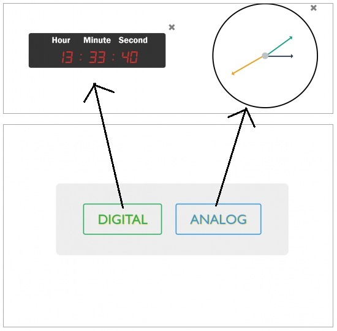
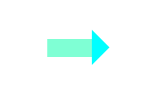
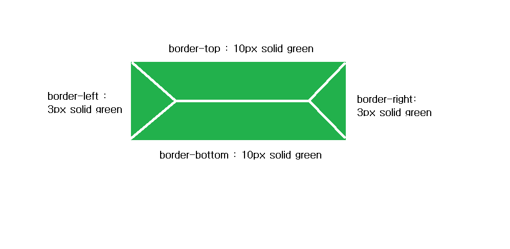
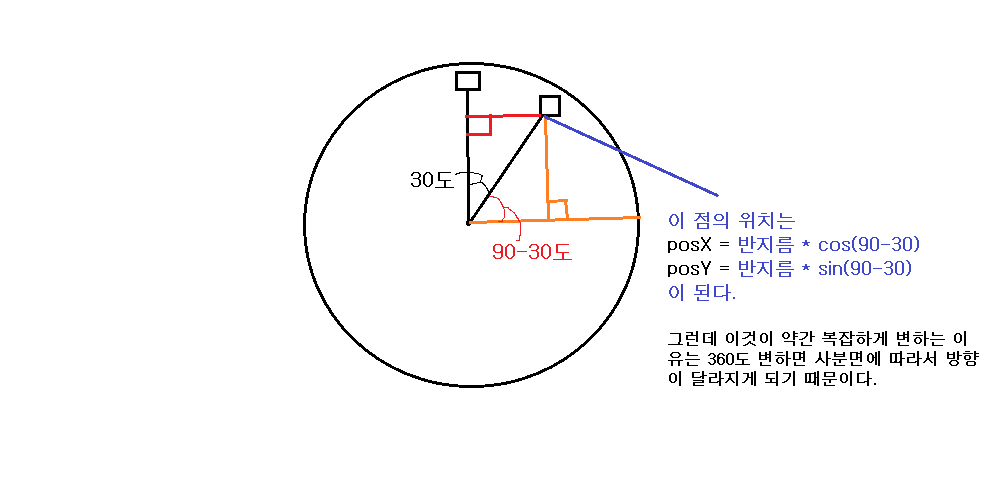

# Day02 : Digital Clock vs Analog Clock

> 디지털 시계와 아날로그 시계의 구현

# Preview



> 버튼을 눌러서 디지털 시계와 아날로그 시계를 골라서 사용할 수 있다.

# Challenge

## analog clock

> 이번 주제 자체는 그렇게 어렵지 않았다. 하지만 아날로그 시계를 만들어본 것은 안타깝게도 처음이다. 사실 아날로그 시계는 자바스크립트의 조작보다도 CSS를 좀 더 세밀하게 다룰 수 있으면 좀 더 깔끔한 아날로그 시계가 되는 것 같다. <del>나는 CSS를 잘 만지지 못하기 때문에...</del>

<br/>

시계의 핸드를 조절하기 위해선 `position : absolute`로 설정하여 시간에 따라서 `transform :rotate(deg)`의 deg를 조정하였다. 자바스크립트를 통해 매초 동적으로 스타일을 바꿔준다. 여기서 각각의 핸드의 위치가 뭔가 정교하지 못해서 약간은 삐툴어진 모습을 보였다. 정확히 딱 떨어지는 위치에 넣었음에도 뭔가 1px정도씩 달라지는 것들 있었는데, 아직까지는 무엇 때문인지 알아내지 못하였다.😭

> CSS는 잘하고자 하면 너무 시간이 오래걸리는 작업인 듯하다😵

<br/>

## Arrow Hands

> 화살표 모양 구현하기

> > `화살표모양`은 여기 저기 생각보다 많이 사용되는 것 같다. 하지만 매번 찾아보는 안타까움이 있어서 여기에 코드를 정리해보고자 한다.

<br />

### Pseudo-Element : before / after

> 가상 요소라고 불리는 before와 after는 HTML에는 구조적으로 존재하지 않지만 CSS를 통해서 임의로 특정 요소를 구현할 수 있도록 만들어진 것이다. 여기서는 화살표모양의 시계 핸드에서 활용하였다._(이외에도 많은 가상요소들이 존재한다.)_

```CSS
  div {
    margin: 5rem;
    width: 50px;
    background-color: aquamarine;
    height: 20px;
  }
  div:after {
    /* content 설정 */
    content: '';
    /* 위치지정 */
    position: absolute;
    top: 69px;
    left: 138px;
    /* border 설정 */
    border-right: 20px solid transparent;
    border-top: 20px solid transparent;
    border-left: 20px solid aqua;
    border-bottom: 20px solid transparent;
  }
```



> 위 코드의 결과이다. 가상요소에 의해서 아쿠아색의 화살표가 표현되었다.

> `before/after` 안에는 반드시 `content`라는 속성을 넣어줘야한다. 위에처럼 특정 내용이 없는 경우 `''` 이렇게 적어주면 된다. 어떤 특정 문구나 요소를 넣어줄 수 도 있다.

<br />

### Border

> 화살표 모양은 before나 after를 이용하지만 사실 `border`에 대해서 정확히 알면 구현할 수 있다고 생각한다.



> border은 위에 처럼 4부분으로 구성된다. 위의 그림은 `width와 height를 0`으로 놓고 border만 설정할 경우 마치 직사각형이 보여진다. 하지만 이렇게 4부분으로 구성된 것이 합쳐진 것이다.

> 만약에 화살표의 끝부분을 만들고 싶다면, `border-left` 만을 남기고 나머지 부분을 `transparent(투명)`처리하면 된다. (길이를 조절하면 좌우상하 관계없이 한부분을 제외하고 나머지를 투명처리하면 된다.)

<br/>

# Improvement

- `Canvas`를 이용한 아날로그 시계의 구현

  > 디지털 시계 같은 경우에는 어렵지 않기 때문에 대부분 초창기에 많이 구현한다. `Date`라는 `built-in object`를 소개하기 위해서 같이 나오는 주제이다. 하지만 아날로그 시계 같은 경우는 구현하지 않는 경우가 많다. 오늘보니 왜 그런지 `어림짐작`할 수 있었다. 그리고 사실 아날로그 시계를 이런식으로 구현할수있다는 것도 최근에 알았다. `Canvas`를 알아야 구현하는 것이라고만 생각하고 있었는데, 나의 무지였던 것 같다.

- 아날로그 시계에 `숫자` 찍기

  > 이 부분은 수학적 능력이 요구된다. 시도는 해보았지만 원하는 위치에 시간을 제대로 찍어낼 수 없었다.

  

  > **생각)** 이런 식으로 삼각함수를 이용하여 접근하여 고민하다보면 해결되지않을까🙄
