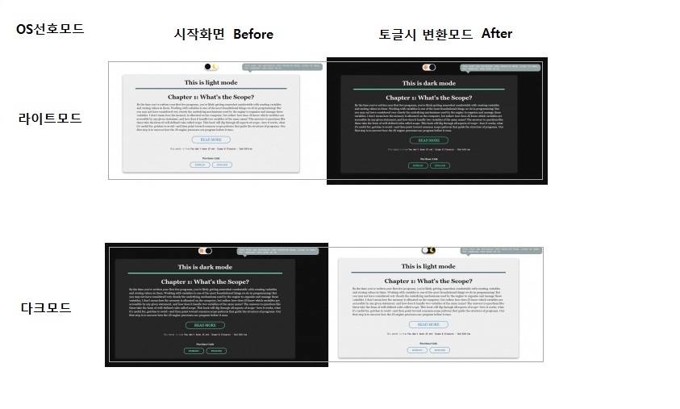

# Day03 : Dark Mode

> 체크박스를 통한 라이트모드와 다크모드 토글 기능 구현

# Preview



# Challenge

다크모드는 웹사이트에서의 사용자 경험을 높이는 트렌트로서 다크모드에 대해서 언급을 많이 한다. 사실 나같은 경우에는 다크모드를 거의 사용해본 경험이 없어서 이 부분에 대한 생각 자체를 해본적이 없었다. 그래서 다크모드에 대해서 구현하는 것을 보면 색상의 대비만 일어나면 되는 것 아닌가 하는 생각으로 만들기 시작했다. 하지만 다크모드를 사용하는 입장에서 생각하다보니 여러가지 신경써야할 부분들이 많이 보였다. 경험하지 않은 것을 구현하기 위한 고민들이 있었던 시간이다.  

## checkbox

> 기본적으로 다크모드는 사용자의 선호에 따라서 활성화 여부를 결정할수있어야 한다. 그 부분을 체크박스를 통해서 구현하였다.

-   checkbox를 사용하기 위해서 알아야 할 것들

    -   event : `change`
    -   attribute : checked

        > checkbox 요소가 체크되었는지 여부를 불리언 값으로 알려준다

        ```javascript
        if ($checkbox.checked) {
            //체크박스가 체크된 상태인 경우에 작동하는 코드
        }

        //코드로 체크박스가 체크된 상태로 설정할 수 있다.
        //javascript
        $checkbox.checked = true;
        //HTML
        <input type="checkbox" checked />;
        ```

    -   체크박스와 함께 다니는 HTML 요소가 있다. 그것은 `label` 이다. label은 말 그대로 라벨링하는 역할을 한다. 특정요소와 결합하여 그 요소를 정의하는데 도움을 준다. 일반적으로 label은 텍스트로서 특정요소를 정의내리고 그 텍스트가 랜더링 된다. 이 때 이 텍스트를 클릭하게 되면 특정 요소와 자동으로 연결되어진다.

        ```HTML
        <input type="checkbox" id="checkbox" />
        <label for="checkbox">체크박스</label>
        ```

        > lebel의 `for`와 연결시키고자하는 요소(여기서는 input)의 `id`가 같아야 연결이 된다. 이 부분을 항상 까먹는다.😡

<br />

## CSS variable

> 순수 CSS에도 변수가 있다는 사실을 알았는가🤯 변수를 사용할 수 있다는 사실을 최근에 알게되었는데 마침 지금이 적기인것 같아서 사용하면서 정리한다.

```CSS
:root{
    --default-color : #e67e22;
    --unique-color : #f1c40f;
}

element1{
    background : var(--default-color);
}
element2{
    color : var(--unique-color);
}
```

> 보통 변수의 선언은 `:root`라는 곳을 선언하고 그 안에서 이루어진다. `:root`는 의사클래스(psuedo class)로서 문서의 트리의 루트요소를 의미한다. 즉 `html{ }`과 같은 것이라고 생각하면 된다. 이렇게 설정해놓으면 HTML 문서 어느 곳에서나 접근이 가능해진다. `변수 : 값` 객체처럼 이렇게 설정해놓는다.

> 설정해 놓은 변수를 가져와 사용하기 위해선 var()라는 함수를 불러와서 그 안의 매개변수로서 위에서 지정한 변수 이름을 적어주면 그 자리를 값이 대체한다.

> 다양한 색이 사용되고 다양한 색이 여러 곳에서 사용된다면, 위에 변수로서 지정해 놓고 사용하면 사용하는 측면에서나 보수하는 측면에서나 좀더 편할거라고 생각한다.

## combinators(결합자)

> CSS를 사용할 때 아무렇지도 않게 사용하는 것이 있다. 그것이 바로 `결합자`라는 것이다. 선택자와 함께 사용되기 때문에 선택자라 생각하고 사용하는 경우도 있다. 요소를 좀 더 세밀하게 선택하기 위해선 `선택자와 결합자의 결합`으로 사용해야하는 경우가 많아진다.

-   `A B` : 선택자 사이의 공백

    > `자손 결합자`로서 A 하위에 있는 `모든 자손들 중에서(깊이에 관계없이)` B에 해당하는 것만 선택한다.

-   `A > B`

    > `자식 결합자`로서 `A 하위의 1단계 깊이`에 해당하는 요소들 중에서 B에 해당하는 것만 선택한다.

-   `A + B`

    > `인접 형제 결합자`로서 A와 같은 깊이의 인접한 바로 다음의 요소가 B인 경우에 그것을 선택한다. 이것은 하나의 요소에만 영향을 미친다.

-   `A ~ B`
    > `일반 형제 결합자`로서 A와 같은 깊이에 있는 요소들 중에서 B에 해당하는 요소를 선택한다.

<br/>

> `input[type='checkbox']:checked + label > .ball` : 이 역시 선택자와 결합자의 결합이다. 여기서 사용한 결합자이다. 이것은 무슨 의미일까?

```CSS
input[type='checkbox']:checked + label > .ball{
    /* 체크박스가 체크되었을 때,
    이와 인접한 바로 다음의 라벨요소 안의 볼을
    선택하는 것 */
}
```

## prefers-color-scheme

> 사용자의 시스템이 라이트 모드 혹은 다크 모드를 사용하는지를 탐지하는데 사용하는 `CSS 미디어 특성`이다.

> 이를 이용하면 자동으로 사용자가 선호하는 모드를 웹페이지에서 연결해줄 수 있다.

```HTML
<div class="dark-mode">Hello World</div>
```

```CSS
.dark-mode{
    color : black;
}

@media (prefers-color-scheme : dark){
    .dark-mode{
        color : #eee;
    }
}
```

> 위에 처럼 코드를 작성하면, 사용자의 OS가 다크모드를 사용한다면 미디어 속성이 작동하여서 그 안에 적혀있는 CSS가 적용된다. _마치 if문 안의 조건처럼 작동하는 것 같다._

> 그런데 다크모드를 사용하는 사용자에게 기본적은 라이트모드와 다크모드를 설정하는 토글키는 제대로 작동을 안하게 된다. 다크모드를 선호하는 유저는 기본적으로 구현된 라이트모드와 다크모드가 반대로 작동해야한다. 즉 사용자의 OS가 선호하는 모드를 자바스크립트로 받아서 그에 따라서 동적으로 모드를 바꿔주도록 만들어줘야했다.

```javascript
if (window.matchMedia('(prefers-color-scheme: dark)').matches) {
    //code here
}
```

> `window.matchMedia('(prefers-color-scheme: dark)')`는 주어진 문자열에 해당하는 미디어 쿼리의에 대한 분석결과를 객체로서 반환한다. 그 객체 안에는 `matches`라는 속성이 있다. 이것은 matchMedia()의 미디어쿼리 문자열이 문서안에서 사용되었다면 true, 그렇지 않으면 false를 반환한다. 즉 이를 이용하면 현재 시스템에서 다크모드 선호 여부를 파악할 수 있고, 이를 통해서 토글키의 기능을 동적으로 바꿔줄 수 있게 된다.

# Improvement

-   다크모드와 라이트모드를 다양한 색상을 주어서 표현하지말자.

    > 색상에 대한 감이 없어서 그런지 다크모드와 라이트모드에 사용하는 색상이 생각보다 많아지게 되었다. 이에 따라서 별로 크지도 않은 문서에 많은 CSS변수가 생성되었고 이로 인한 복잡도가 증가하였다. 지금드는 생각으로는 다크모드를 사용할 때는 많은 색상의 변화를 주지는 않고 중요 키색상에 대한 변화를 주는 것이 구현할 때 좀 깔끔하게 구현하는 방법이라는 생각이 든다.

-   다크모드는 왜 트렌드가 되었을까?
    > 이에 대한 대답은 [좋은 블로그](https://brunch.co.kr/@thinkaboutlove/276)로 대체해볼까한다.
