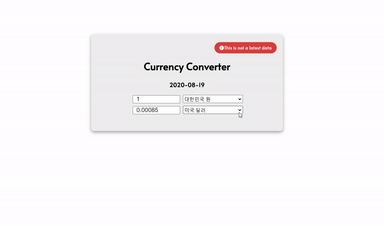
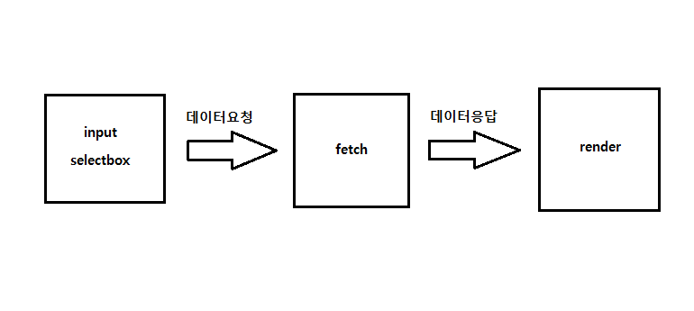

# Day04 : Currency Converter

> 환율 계산기

# Preview

# Challenge

> 환율계산기의 구현을 위한 데이터 흐름이다.

> 이벤트가 일어날 수 있는 장소는 총 3군데이다.
 - `얼마의 값`을 환율로 바꿀 것인지 : **input**
 - 그 얼마의 값이 `어느 나라의 값`인지 : **selectbox**
 - `어떤 나라의 환율`로 바꿀것인지 : **selectbox**

> 위 3가지 중에서 한가지라도 이벤트가 일어날 때 데이터 요청이 일어나도록 구현하였다. 단, 위 3가지 이벤트에 해당하는 값이 모두 존재하는 경우에만 가능하다. 기본적으로 위 3가지의 기본값을 할당해줬기 때문에 사용자가 임의로 값을 제거하지 않으면 작동하게 설계하였다.

> 환율 데이터를 얻어오기 위해선 [fetch API](https://developer.mozilla.org/ko/docs/Web/API/Fetch_API/Fetch%EC%9D%98_%EC%82%AC%EC%9A%A9%EB%B2%95)를 사용하였다.

> 사용자가 입력한 값을 그에 맞는 환율로 변환하여 input text에 출력한다. 이 곳의 input은 `readonly`로 설정하였다. 이 부분은 사용자가 인위적으로 바꾸면 안되는 부분이기 때문이다.

# Improvement
- 내가 사용한 API가 최신의 환율을 가져오진 않는 것을 알게되었다. (정확히 하루 전 날의 환율을 가져온다 😥) 이 부분에 있어서 [실제 구글 환율 변환기](https://www.google.com/search?q=%EA%B5%AC%EA%B8%80+%ED%99%98%EC%9C%A8&oq=%EA%B5%AC%EA%B8%80+%ED%99%98%EC%9C%A8&aqs=chrome.0.69i59j0l7.6080j1j7&sourceid=chrome&ie=UTF-8)와 결과값을 비교해보니 그렇게 큰 오차가 나지않아서 `큰 차이가 나지 않는다`라고 착각을 하였다. `환율`이라는 소재에 대한 이해 부족이였다. 미세한 환율 변화만으로도 많은 부분에서 영향을 받을 수 있는 것이 현실인데, 그러한 부분을 인지하지 못하였다. 이렇게 데이터의 정확도가 민감한 소재인 경우엔 실제로 어플리케이션을 구현 할 때는 이 부분을 우선 순위로 놓아야 한다는 것을 상기시킬 수 있는 좋은 시간이였다.