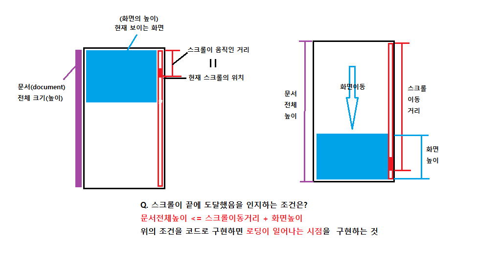

# Day05 : Infinite Scroll

> 무한 스크롤

# Preview


<br />

# Challenge

> 컨텐츠를 보여주는 방법으로서 보통 2가지를 거론한다. 한가지는 전통적으로 자주 접하는 페이징, 두번째는 이번에 구현한 무한 스크롤이다. 무한 스크롤은 주로 유투브를 검색하다 자주 접할 수 있다. 유투브의 영상은 언제나 무한 스크롤을 통해서 검색어에 관련된 영상이 진짜 끊임없이 나온다. 😬 개인적으로 페이징보다 유투브가 '나의' 사용자경험 측면에서는 더 좋은 느낌이다.(지극히 개인적인...😁) 페이징이나 무한로딩 모두 장단점을 갖고 있다. 그렇기 때문에 어느 것을 선택하는냐는 어떤 컨텐츠를 누구에게 어떻게 보여주는 것이 효율적인지를 판단하여 선택하여야만 하겠다. (참고 [Infinite Scrolling vs. Pagination](https://uxplanet.org/ux-infinite-scrolling-vs-pagination-1030d29376f1))

## scroll

> 스크롤 이벤트를 걸어주면서, 가장 먼저 생각할 문제는 `추가 컨텐츠를 로딩하는 시점`을 어떻게 구현할 것인가에 대한 문제다. 답은 나와있다. 스크롤이 끝에 닿았을 때!!👍 **BUT** 그건 어떻게 아는데?? 띠옹😭...그러게 말입니다...



> 위 그림은 말로 설명한 것이다. 우선 말로 이해가 되어야 구현도 가능하다. 또한 각각의 명칭에 해당하는 속성이 Web 속에는 존재한다.👍

```javascript
//1) 문서전체의 크기 === document height
document.documentElement.offsetHeight;
//=> document.documentElement === <html>를 반환하는 것
//=> 특정엘리먼트의 전체 크기를 알고 싶을땐, offset~~을 사용한다.

//2) 스크롤이 움직인 거리
document.documentElement.scrollTop;

//3) 화면의 크기
window.innerHeight;
//=> 참고로 window.outerHeight는 윈도우창에서 툴바등을 다 포함한 길이이다.
//우리는 딱 보이는 화면의 크기만 알면 된다.

document.documentElement.offsetHeight <= document.documentElement.scrollTop + window.innerHeight;
//=> 같아지는 시점이 정확히 화면이 문서의 끝에 닿는 시점이라고 볼 수 있다.
```

> 위 조건에 맞을 때 마다 `fetchData()`를 하도록 구현하였다.

<br />

## throttle

> `throttle` 이란 이벤트나 함수가 `특정시간 동안 최대 1번만 실행`되도록 조절하여 성능상의 효율의 가져오기 위한 개념을 말한다. 이와 같이 나오는 개념으로는 `debounce`가 있다.

> > 참고) `debounce`는 지속적인 이벤트가 일어날 때, 특정 시간동안의 이벤트를 모아서 `그 시간이 끝난 직후에 한 번만 실행`하도록 만들어주는 개념이다.

> > 2가지의 차이를 이해하는게 사실은 쉽지 않다. 처음봤을 땐 한국말이 한국말이 아닌 느낌이었다.🤯 `실제적인 사례를 직접 보고 느끼고 구현해보면` 훨씬 이해가 빠를 수 있다는 것을 무한 스크롤을 구현하면서 느꼈다. `debounce` 역시 실제 사례를 통해서 만나는 날 좀 더 명확하게 이해할 수 있을 것 같다.

> > throttle과 debounce가 이해되지 않는다면 `lodash 의 공식문서`를 잘살펴보자. ( [throttle](https://lodash.com/docs/4.17.15#throttle), [debounce](https://lodash.com/docs/4.17.15#debounce) )

### 그런데 왜 throttle을 사용한 것인가??

> 위의 화면이 문서 끝에 닿는 조건은 사실 딱 한가지가 존재하는 것이 아니다. 즉, 데이터 요청이 한 번만 일어나고 끝나는 것이 아니라는 말이다. 이렇게 되면 원하지 않을 때 지속적인 데이터 요청으로 인해 페이지의 성능이 떨어지고 원하는 시간에 제대로 된 데이터 로딩이 이루어지지 않을 수 있다. 실제로도 조건에 맞을 때 30개의 이미지를 한 번만 로딩하도록 구현하였지만 30개를 넘어 60개, 많게는 90개씩 로딩되는 경우도 생겼다. 이를 막기위해서 특정 이벤트가 일어나는 시점에는 딱 한 번만 이벤트가 발생하도록 구현하기 위해 위의 개념을 사용한 것이다.

```javascript
function makeThrottle(func, wait) {
    let isExecuted = false;

    return function () {
        if (!isExecuted) {
            func();
            isExecuted = true;
        }
        setTimeout(() => {
            isExecuted = false;
        }, wait);
    };
}
```

> 위의 함수는 `클로저의 개념`을 이용하여 구현하였다. makeThrottle 함수에서 반환되는 함수는 isExecuted라는 flag를 사용할 수 있는 상태로 반환된다. 즉 `함수와 함수가 생성될 때의 환경을 갖고 있는 것`을 **클로저**라고 한다.

<br />

## lazy loading

> 웹사이트가 로드될 때 서버와의 접속을 통해서 데이터를 받아서 그것을 페이지에 랜더링 한다. 이 때 서버와의 접속이 많을수록 혹은 길수록 웹사이트는 느리게 로드된다. 이러한 상황을 극복하기 위해서 `lazy loading`이라는 개념이 등장하였다.

> 페이지가 로드될 때, 처음부터 많은 양의 컨텐츠를 다 받아서 랜더링한다고 하자. 그런데 사용자가 그 페이지가 아닌 다른 페이지로 바로 넘어갔다. 이런 상황이라면 현재 페이지를 로드하기 위해서 사용한 자원이 낭비된 자원이 된다. 이러한 상황을 해결하기 위해서 사용자가 보고있는 화면의 컨텐츠만을 로드하여 불필한 자원 낭비를 막는 방법이 바로 `lazy loading`이다.

# Improvement

-   [Intersection Observer](https://developer.mozilla.org/ko/docs/Web/API/Intersection_Observer_API)로 무한 스크롤 구현하기
