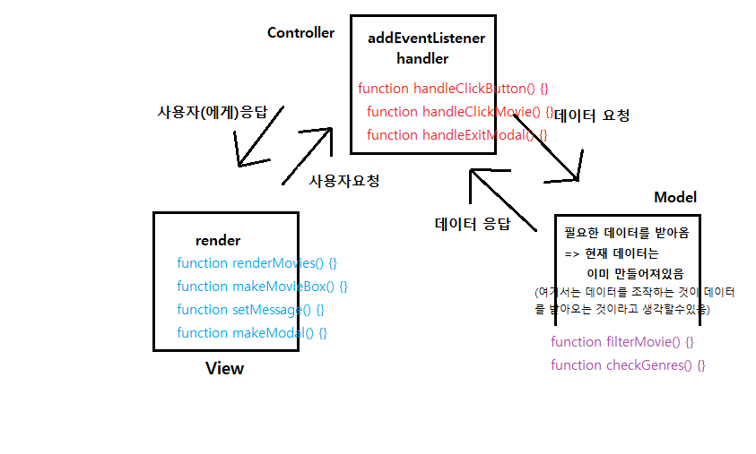

# Day06 : Movie Filter

> 현재 개봉된 영화를 원하는 조건에 맞게 필터링하여 분류하는 기능 구현

> [DEMO](https://codesandbox.io/s/day06movie-filter-xzngy)

<br/>

# Preview


> **사담)** 항상 느끼는거지만, 나의 gif는 왜케 화질이 구릴까...좋은 곳을 찾아보아야 👽

<br/>

# Challenge

> `fetch API`를 사용하여서 가져온 데이터를 조작하여 랜더링하는 기능을 구현하려고 시작하였다. 하지만...비동기적으로 작동하는 `fetch`이기에 내가 원하는 시점에 데이터를 받아서 조작할 수 없었다.

> 실제 사이트에서 데이터를 검색해오는 페이지를 살펴보면, 많은 데이터를 받아와서 조작하지않는다. 검색어등을 통해서 어느 정도 걸러진 상태의 데이터를 받아와서 그 데이터를 조작한다. 즉 거대한 데이터를 받아서 조작하는게 아니라 걸러진 데이터를 받아와서 데이터 내부를 조작한다. 그런데 난 전자처럼 할라고 했던 것이다.

> > 할려고 하면 어떻게든 할 수도 있지 않을까라고 생각을 했지만 그렇게 하는 것은 마치 `콜백헬`처럼 복잡하게 만들어짐을 어느정도 만들어 가면서 직감하게 되었다. 그래서 **계획 수정**!! <u>fetch를 사용하지않고</u> 거대한 데이터를 받아서 `배열 형태`로 그냥 넣었다.😅

> > > 이 미니 프로젝트의 데이터 필터링에 초점이 맞춘 것이기 때문에 그것에 충실하기로하였다.

## MVC

-   model : 데이터를 조작하는 파트로서 데이터라고 부르기도 한다.
-   view : 사용자와 직접 접하는 부분을 구현하는 파트
-   controller : 모델과 뷰를 연결짓는 파트로서 사용자의 요청(뷰에서 일어남)을 모델로 전달하거나 모델에서 가공된 데이터를 뷰로 전달하는 파트

> MVC는 가장 잘 알려진(?) 디자인 패턴이다. 어떤 조그만한 프로그램을 만들더라고 이 구조로 구성할 수 있다. 내가 지금 만든 이 프로젝트 역시 이런 식으로 구성이 가능하다. 코드의 구조를 항상 이런 형태로 만들려고 노력중인데 잘안된다.🤬

> > `MVC`와 `OOP`의 개념을 이용하여 많이 만들어야 할 것 같다.

```javascript
function filterMovie() {}
function checkGenres() {}
function renderMovies() {}
function makeMovieBox() {}
function setMessage() {}
function makeModal() {}
function handleClickButton() {}
function handleClickMovie() {}
function handleExitModal() {}
```

> 위는 내가 이 프로젝트에서 만든 함수들이다. 지금은 규모가 작기 때문에 파일을 나누고 모듈형식으로 만들필요까지 없었지만, 그렇게 했어도 좋은 경험이 되었을 것 같다. 위의 함수들을 MVC에 해당하는 것들로 분류해보자 ❗



> 이렇게 분류했지만 아직 명료하지않다. 랜더링 말고는 아직 뚜렷하지않은 것 같다. 이러한 `코드의 구조`로 많이 만들어보고 접해봐야할 것 같다.

<br />

# Improvement

-   [ ] `movie sort` 기능을 추가해보자

    > `평점/인기`에 따른 `오름차순/내림차순`

    > 맨 처음 설계한 기능으로는 `movie filter`와 `movie sort`를 동시에 집어 넣는 것이였다. 하지만 이를 만들고자 할 때 두가지 조건을 어떤 식으로 조합할지에 대해서 고민이 깊어지면서, 한가지의 기능에 집중하자고 합리화(?😅)하여 지금의 filter기능만 존재하게 되었다...(는 설이있다.)
